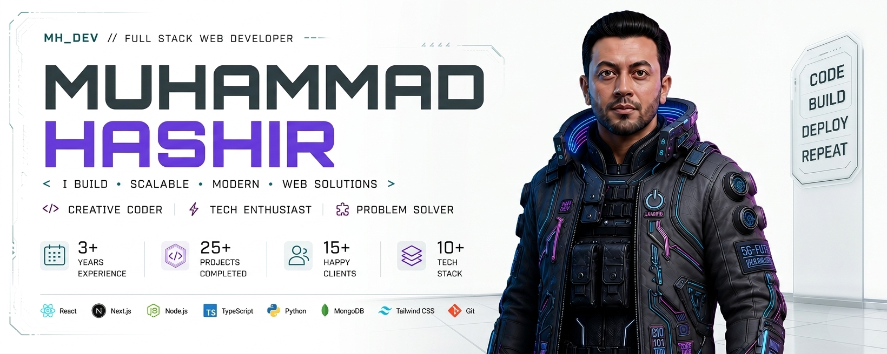

<div align="center">

# Hi there, I'm Muhammad Hashir! 👋

🌍 **Based in Pakistan** | 💡 **Passionate about building innovative solutions**

*Full-Stack Developer | Cloud Architect | AI Solutions | Web Developer | Mobile Apps*

</div>

Welcome to my GitHub profile! I'm a passionate software developer with a love for creating seamless, user-friendly applications. I enjoy working on both frontend and backend technologies, and I'm always eager to learn and explore new tools and frameworks.

---

## 🛠️ **Technologies & Tools**

<table>
<tr>
<td width="50%">

**Frontend:**


</td>
<td width="50%">

**Backend:**


</td>
</tr>
<tr>
<td width="50%">

**Databases:**


</td>
<td width="50%">

**Cloud & DevOps:**


</td>
</tr>
</table>

---

## 🚀 **What I Build**

<table>
<tr>
<td width="50%">

🏢 **Enterprise Web Apps**
SaaS Platforms
REST APIs

</td>
<td width="50%">

☁️ **Cloud Solutions**
E-Commerce
Real-time Dashboards

</td>
</tr>
<tr>
<td width="50%">

🤖 **AI-Powered Applications**
Mobile Apps

</td>
<td width="50%">

📊 **Data Analytics**
Automation Tools

</td>
</tr>
</table>

---

## 📊 **GitHub Stats**

<table>
<tr>
<td width="50%">

</td>
<td width="50%">

</td>
</tr>
</table>

<div align="center">

</div>

---

## 🎯 **Fun Fact**

I once built an automation script that monitors my GitHub contributions and sends AI-powered insights to my dashboard! 🤖📊

---

```python
#!/usr/bin/python
# -*- coding: utf-8 -*-
class SoftwareEngineer:

    def __init__(self):
        self.name = "Muhammad Hashir"
        self.role = "Passionate Full-Stack Developer | AI Enthusiast"
        self.language_spoken = ["en_US", "ur_PK"]
        self.specialization = ["Web Development", "Cloud Architecture", "AI Integration"]

    def say_hi(self):
        print("Thanks for dropping by, hope you find some of my work interesting.")

me = SoftwareEngineer()
me.say_hi()
```

---

## 🌟 **Let's Connect!**

<div align="center">

[](mailto:m.hashir28@gmail.com)
[](https://www.linkedin.com/in/muhammad-hashir-a94293116/)
[](https://github.com/MuhammadHashir28)
[](https://yourportfolio.com)

</div>

<div align="center">

**Available for Freelance Projects & Full-Time Roles**

*Building modern digital experiences through clean code and scalable architecture.* 🚀

</div>
